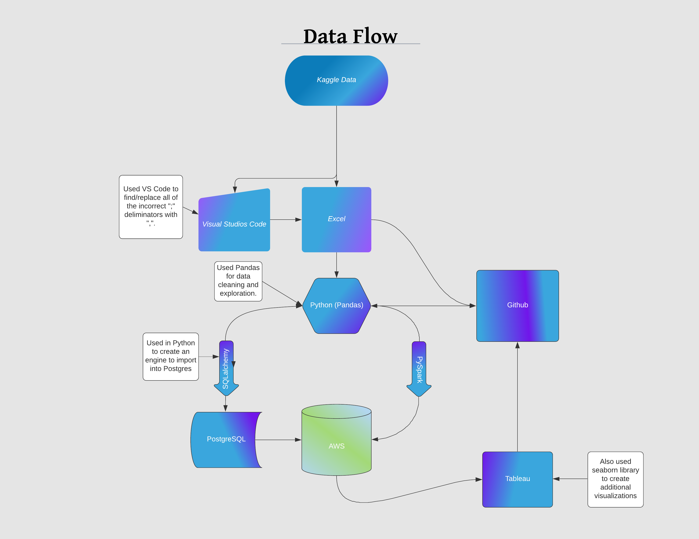
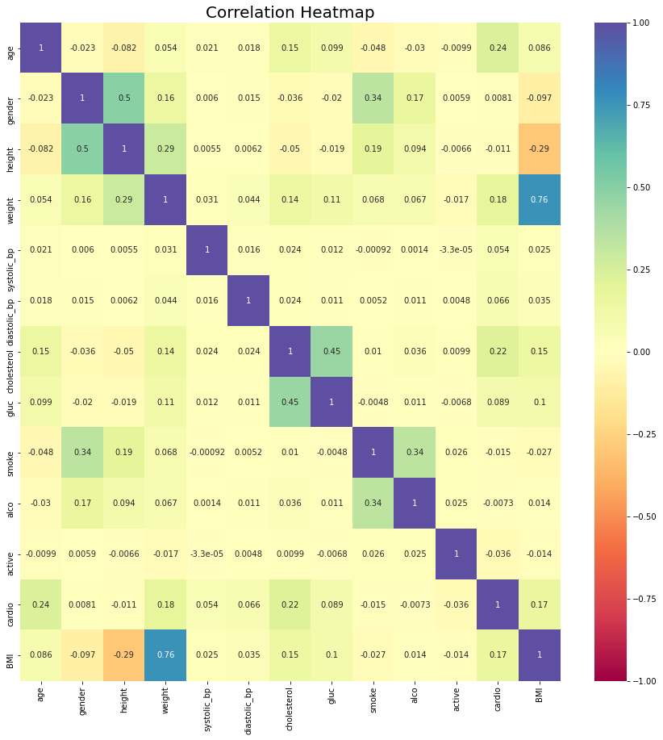
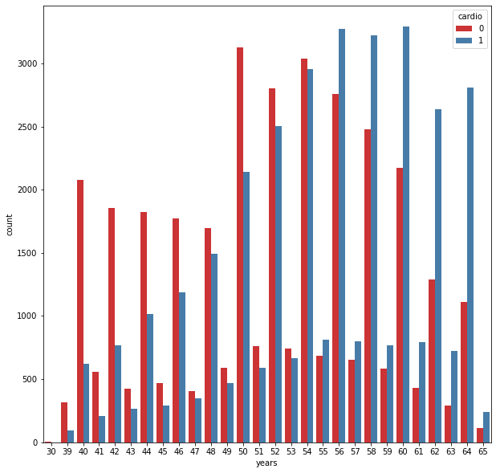
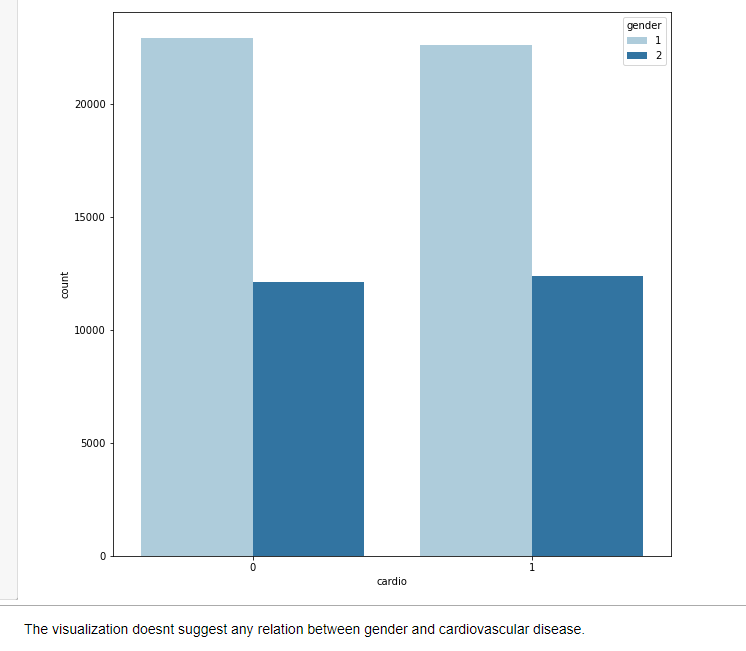
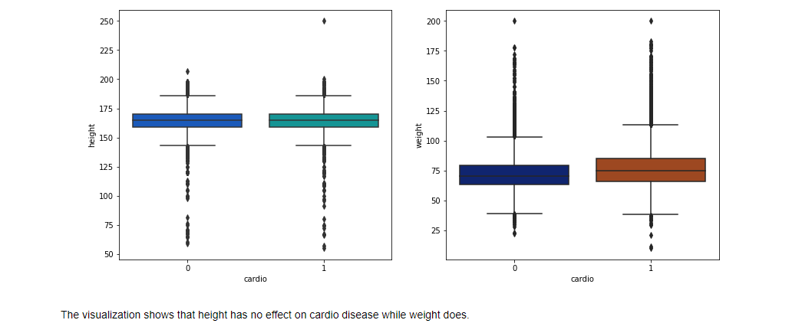
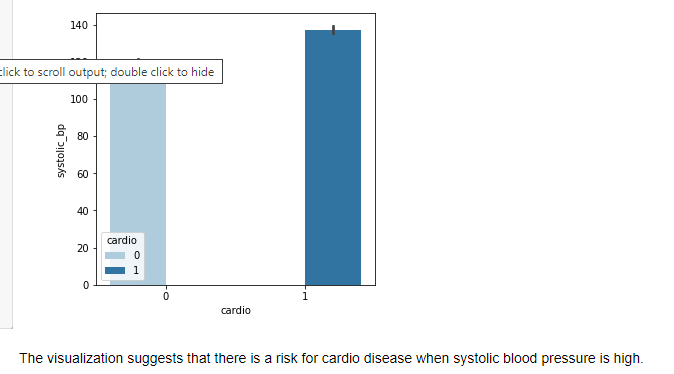
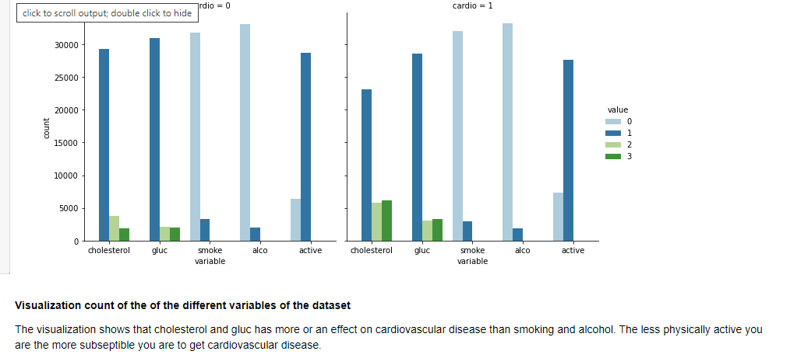
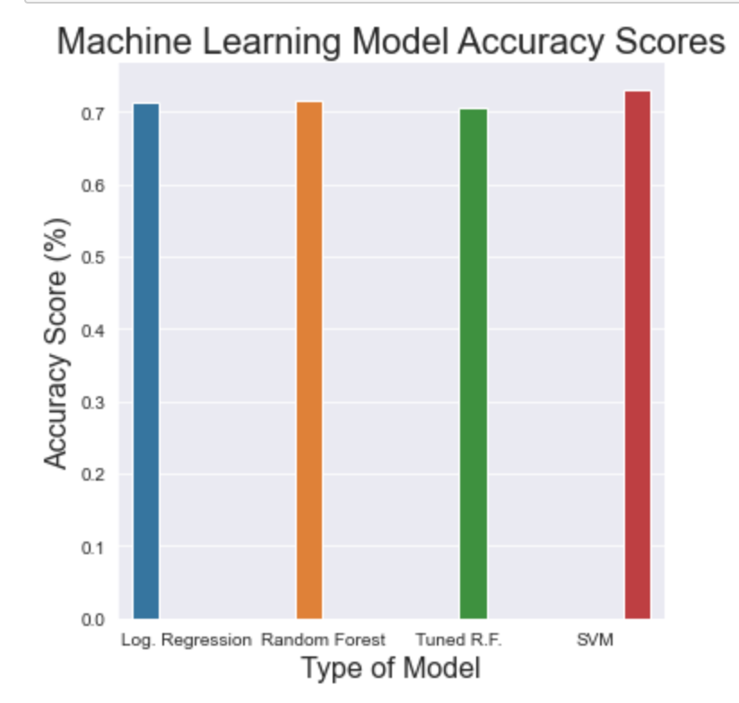

# Risk Factors for Cardiovascular disease

## Group Members: 
Nick Guild, Cedric Larue, Ling Zhang, and Teale Foster

## Communication Protocols
Group members uses Slack and messages for communications and also using Zoom for group meetings. 

## Tools
SQL, Python and using Tableau for Data visualizations

## Presentation
https://docs.google.com/presentation/d/1CLn6aMWFkfWZ_EBmw5tNoQWBXpHDvC8jLaq04usb684/edit?usp=sharing

## Dashboard
https://docs.google.com/presentation/d/1dkKnMS9PdWOnYIQ0ZZtfbRx3UqNOwxuxdaFpwCcaJWw/edit?usp=sharing

## Data Source
Our dataset was taken from a Kaggle dataset with 70,000 plus data points that was uploaded a little less than two years ago. It contains thirteen columns (12 feature columns and the outcome column, cardio).  The original uploader is a researcher named Svetlana Ulianova.

## Summary of the Project
- The research topic we chose was an exploration of cardiovascular disease, and the factors (features) that can lead to its occurrence.

- The reason why we selected this topic is because of its importance, according to the World Health Organization: “Cardiovascular diseases (CVDs) are the number 1 cause of death globally, taking an estimated 17.9 million lives each year.” https://www.who.int/health-topics/cardiovascular-diseases#tab=tab_1
So it would be critical for us to gain more knowledge about this and therefore, to be able to predict and prevent ourselves from getting the CVDs. 

- The dataset used contains data for cardiovascular disease patients that we found from Kaggle.com; The data in the file used contains information on a patient’s age, gender, height, weight, cholesterol levels, glucose levels, BMI, whether they smoked, used alcohol, or their level of physical activity. These metrics all play a deciding factor in whether a person develops cardiovascular disease. There were no potential outliers found in the dataset, also no metric involved has been proven to any other statistically, also any missing values were removed to prevent errors in results.

- We are hoping that, with the help of Machine Learning Models, we will be able to better predict what features would be the most critical concerns for people, higher predictability score would means that the features are more relative with CVDs, and therefore we can have a better idea on how to prevent getting CVD related diseases.  

- We have four Machine Learning Models: Logistic Regression, SVM, Random Forest and Decision Tree. After doing the Ramdom Forest we have found out that among all of the features that we have tested so far, the ones with the highest level of predictability on the occurrence of heart disease were: Subject's age, Systolic Blood Pessure and Subject's body mass Index. Surprisingly, the ones that we thought could have higher scores doesn't show significant evidence, such as smoke or not, and drinking excessive alcoholic beverages and also level of exercise taken. 

## Data Exploration

Above shows our data flowing chart and the process that we process the data. 

By analyzing above graph, we discover that age, weight, cholesterol, gluc are more correlated to cardio variable compared to other factors.

With increase in age, the risk of getting cardiovascular disease increases. From above graph , we can see that people from age group 55-65 are more prone to cardiovascular diseases.

Above, we can see that there are no clear relations between CVDs and gender. 

We can see that height has no effects on CVDs while weight does. 

Above visualization showing us that higher blood pressure will increase the risk of having CVDs. 

Cholesterol and gluc has more effect on CVDs than other elements, while it also showing that the less physically active you are, more likely you will have CVDs. 

We  used three methods: Logistic Regression, the Random Forest (and a tuned version of Random Forest), along with SVM; Logistic Regression has a score of .7128; Random Forest has an accuracy score of .729; SVM has an accuracy score of .7304. Therefore we say that the best fitted model for predicting cardiovascular disease is : “SVM”

